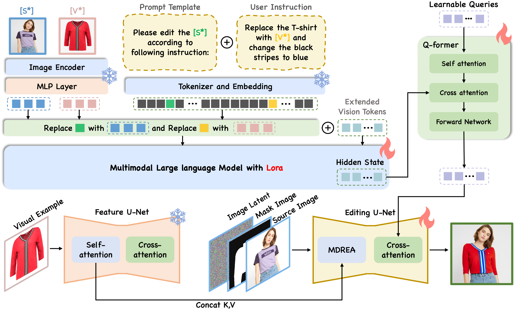

# EditMaster: Bridging Text Instruction and Visual Example for Multimodal Guided Image Editing

📄 **Paper:** [ACM MM 2025](https://doi.org/10.1145/3746027.3754926)  
🏫 **Authors:** Jiahui Zhang, Mengtian Li*, Jiewei Tang, Junyu Deng, Siyu Tian, Xiang Liu, Meng Zhang, Guangnan Ye*, Yu-Gang Jiang  
(*Corresponding author)

---

## 🧩 Overview
**EditMaster** is a unified multimodal image editing framework that integrates **text instructions** and **visual examples**.  
By combining semantic understanding and visual fidelity, EditMaster enables flexible, fine-grained, and context-aware image editing — going beyond the limitations of unimodal methods.

<p align="center">
  
</p>

---

## 🚀 Highlights
- 🔹 Unified **multimodal instruction-guided editing** framework  
- 🔹 **MDREA (Mask-based Decoupled Residual Exemplar-Attention)** module for precise, region-aware editing  
- 🔹 **Pre-edit visual guidance** via Multimodal Large Language Models (MLLMs)  
- 🔹 Efficient **MultiEdit dataset** construction pipeline

---

## 📅 Code Availability
The official implementation of **EditMaster** is **coming soon** 🧑‍💻  
We are currently organizing the codebase and preparing documentation for public release.  
Stay tuned — the full code, pretrained models, and MultiEdit dataset will be available here shortly!

---

## 📊 Dataset
> 🔗 http://150.158.167.199:8080/files/MultiEdit-v1/

---

## 📜 Citation
If you find this work useful, please consider citing our paper:
```bibtex
@inproceedings{zhang2025editmaster,
  title={EditMaster: Bridging Text Instruction and Visual Example for Multimodal Guided Image Editing},
  author={Zhang, Jiahui and Li, Mengtian and Tang, Jiewei and Deng, Junyu and Tian, Siyu and Liu, Xiang and Zhang, Meng and Ye, Guangnan and Jiang, Yu-Gang},
  booktitle={Proceedings of the 33rd ACM International Conference on Multimedia},
  year={2025}
}
